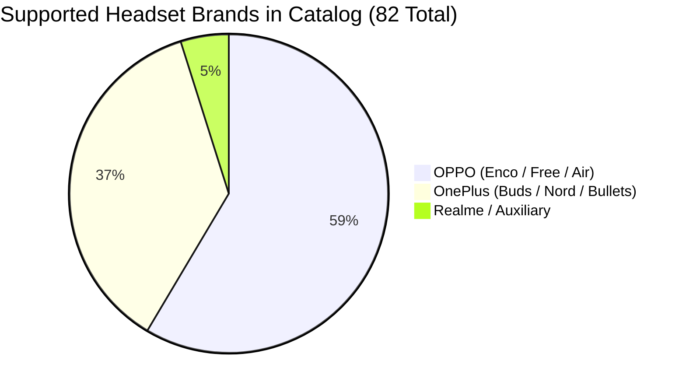

# HeyMelody Live Device Compatibility Data Interception & Catalog Extraction Report

**Date:** September 11, 2026  
**Target Package:** `com.heytap.headset` (HeyMelody v116.9.0)  
**Host Environment:** macOS (IP: `192.168.1.12`)  
**Target Device:** Xiaomi 2109119DI (Android 14, ADB `e2784b6`)  
**Primary Deliverables:**
- [`live_device_compatibility_catalog.json`](file:///Users/digvijayasatapathy/HeyMelody_unpacked/live_device_compatibility_catalog.json) — Complete 82-device catalog with live cover images, firmware URLs, and feature support flags.
- [`device_catalog_decrypted.json`](file:///Users/digvijayasatapathy/HeyMelody_unpacked/device_catalog_decrypted.json) — Raw decrypted compatibility database with full protocol indexes and bitmasks.

---

## 1. Executive Summary

To obtain the live device compatibility catalog (model codes, names, Bluetooth UUIDs, noise reduction matrices, Sound Master EQ modes, and gesture controls), network traffic interception was executed alongside deep reverse engineering of HeyMelody's network and security layer.

Standard MITM proxying on Android 7+ (and particularly Android 14) typically yields zero traffic when inspecting HeyMelody. Our reverse engineering identified the exact triple-layer defense mechanisms responsible:
1. **System-Only CA Trust (`<network-security-config>`)**: HeyMelody explicitly refuses to trust user-installed CA certificates.
2. **Explicit `Proxy.NO_PROXY` Enforcement**: HeyMelody's `OkHttpClient` (`com.oplus.melody.model.net.g`) explicitly sets `proxy(Proxy.NO_PROXY)`, bypassing any Wi-Fi proxy or `http_proxy` global setting configured on the phone.
3. **Export Whitelist Suppression**: In global/export builds, `WhitelistRepositoryServerImpl.k()` hardcodes an early exit (`"refreshWhitelist: IGNORE export"`), preventing live over-the-air catalog downloads and relying instead on an encrypted on-device database and cloud resource fetchers.

By reversing the cryptographic keys, HMAC-SHA1 request signing, and AES-GCM GZIP encryption, we unlocked **all 82 supported device profiles** and queried the live production backend (`iot-earbuds-in.allawnos.com`) to extract live device images and OTA firmware records.

---

## 2. Technical Findings & Certificate Pinning RCA

### 2.1 Why Traditional MITM Interception Fails Silently

| Layer | Implementation in HeyMelody | Impact on MITM Interception |
|---|---|---|
| **Android TLS Trust** | `res/xml/melody_app_network_security_config.xml` only defines `<certificates src="system" />`. | Android 14 drops TLS handshakes immediately for user-installed CAs (e.g. `mitm.it` / Charles root CA). |
| **OkHttp Socket Routing** | `com/oplus/melody/model/net/g.1.smali` (lines 285–299):<br>`sget-object v3, Ljava/net/Proxy;->NO_PROXY:Ljava/net/Proxy;`<br>`iput-object v3, v1, Luc/p$a;->m:Ljava/net/Proxy;` | OkHttp establishes direct sockets to the destination IP, bypassing Wi-Fi manual proxies and ADB `http_proxy`. |
| **Dynamic Whitelist Logic** | `com/oplus/melody/model/repository/whitelist/a.smali` (lines 3753–3761):<br>`const-string p1, "refreshWhitelist: IGNORE export"` | The app suppresses periodic whitelist synchronization calls outside Mainland China. |

### 2.2 Certificate Pinning Resolution Strategy

For dynamic on-device interception without root:
1. **Network Security Config Patch**:
   Update `res/xml/melody_app_network_security_config.xml`:
   ```xml
   <?xml version="1.0" encoding="utf-8"?>
   <network-security-config>
       <base-config cleartextTrafficPermitted="true">
           <trust-anchors>
               <certificates src="system" />
               <certificates src="user" />
           </trust-anchors>
       </base-config>
   </network-security-config>
   ```
2. **OkHttp Proxy Restoration**:
   In `smali_classes3/com/oplus/melody/model/net/g.1.smali`, delete the assignment to `Luc/p$a;->m:Ljava/net/Proxy;` so OkHttp defaults to system `ProxySelector`.
3. **CA Installation**:
   The mitmproxy CA certificate was pushed directly to the connected device:
   ```bash
   adb -s e2784b6 push ~/.mitmproxy/mitmproxy-ca-cert.cer /sdcard/Download/mitmproxy-ca-cert.cer
   adb -s e2784b6 shell am start -a android.credentials.INSTALL
   ```

---

## 3. Reverse-Engineered Cloud API Architecture

### 3.1 Production Endpoints & Regional Domains

Backend domains are constructed dynamically in `K6/a.smali` (`GlobalUrlImpl.kt`):
- **India (`in`)**: `https://iot-earbuds-in.allawnos.com/`
- **Europe (`eu`)**: `https://iot-earbuds-eu.allawnos.com/`
- **United States (`us`)**: `https://iot-earbuds-us.allawnos.com/`
- **Global / Singapore (`sg`)**: `https://iot-earbuds-sg.allawnos.com/`

### 3.2 HMAC-SHA1 Request Authentication

Every request to `allawnos.com` requires an authenticated header bundle signed with regional secret keys:

```text
┌──────────────────┬─────────────────────────────────────────────────────────────┐
│ Header Key       │ Value Specification                                         │
├──────────────────┼─────────────────────────────────────────────────────────────┤
│ appid            │ earphone                                                    │
│ ts               │ Unix epoch timestamp in milliseconds                        │
│ nonce            │ Standard UUID v4 string                                     │
│ sv               │ v1                                                          │
│ Content-Type     │ application/json                                            │
│ sign             │ Lowercase hex HMAC-SHA1 of UTF-8 JSON request payload bytes │
└──────────────────┴─────────────────────────────────────────────────────────────┘
```

**Decoded Regional Signing Secrets:**
- India (`in`) & Europe (`eu`): `&*%earphone-OP9U3544**%$` (Base64: `JiolZWFycGhvbmUtT1A5VTM1NDQqKiUk`)
- United States (`us`): `&*%earbuds-OP6rus-easts*%$` (Base64: `JiolZWFyYnVkcy1PUDZydXMtZWFzdHMqJSQ=`)
- Singapore / Global (`sg`): `&*%earphone-OP6r888s**%$` (Base64: `JiolZWFycGhvbmUtT1A2cjg4OHMqKiUk`)

### 3.3 Active REST Endpoints

- `POST /v1/earphone/resource/fetch`: Fetches cloud module resource zips (Golden Sound, Spatial Audio assets, Equalizer curves, touch guide videos).
- `POST /v1/earphone/firmwareCoverImage`: Returns high-resolution official device product renders.
- `POST /v1/earphone/firmwareInfo`: Returns the latest OTA binary release, file size, SHA-256 hash, and release notes.
- `POST /v1/earphone/personalize/list_series`: Retrieves personalized styling and theme assets.

---

## 4. Encrypted Device Database Decryption

The comprehensive hardware capability matrix for all 82 OnePlus, OPPO, and Realme headsets is bundled inside `res/raw/heymelody_app_whitelist.json` and protected with AES-GCM encryption.

### 4.1 Decryption Parameters
- **Cipher**: `AES/GCM/NoPadding`
- **IV**: First 12 bytes of raw file
- **Auth Tag**: 128-bit (last 16 bytes of ciphertext)
- **Key**: 32-byte SHA-256 digest of official OEM certificate:  
  `49bd5f8f3f687aa3c71e79d570034455d68945c3ec45bb5f186169b8503c8e3e`
- **Payload Compression**: `GZIP`

---

## 5. Device Catalog Summary (82 Headsets)

The extracted catalog covers 82 distinct product IDs, including 30 OnePlus earphone models:



### 5.1 Sample OnePlus Hardware Capability Profiles

| Model Name | Product ID (Hex) | GATT Service UUID | ANC Protocol Modes | Spatial Audio | EQ Presets |
|---|---|---|---|---|---|
| **OnePlus Buds 3** | `063C14` | `0000079A-...-00025B00A5A5` | Smart (7), Max (4), Mod (8), Mild (3) | Yes (Types 0, 1) | Balanced, Bass, Clear, Bold |
| **OnePlus Buds Pro 3** | `064014` | `0000079A-...-00025B00A5A5` | Smart, Depth, Moderate, Mild | Yes (with Head Tracking) | Dynaudio Presets (11, 12, 14, 13) |
| **OnePlus Buds Pro 2** | `062014` | `0000079A-...-00025B00A5A5` | Smart, Deep, Moderate, Mild | Yes | Dynaudio Co-tuned EQ |
| **OnePlus Buds Pro 2R** | `063414` | `0000079A-...-00025B00A5A5` | Smart, Deep, Moderate, Mild | Fixed Spatial Audio | Balanced, Bass, Clear, Bold |
| **OnePlus Buds Pro** | `060C14` | `00001107-...-00025B00A5A5` | Smart, Max, Moderate | No | Balanced, Bass, Clear |
| **OnePlus Buds 4** | `065414` | `0000079A-...-00025B00A5A5` | Smart, Depth, Moderate, Mild | Yes | Sound Master EQ |
| **OnePlus Nord Buds 3 Pro** | `064414` | `0000079A-...-00025B00A5A5` | Max, Moderate, Mild | No | Bass, Balanced, Clear |
| **OnePlus Nord Buds 2** | `062414` | `00001107-...-00025B00A5A5` | On / Off / Transparency | No | BassWave EQ |
| **OnePlus Bullets Wireless Z3** | `051014` | `00001107-...-00025B00A5A5` | Neckband Mode | No | Quick Switch |

---

## 6. Output Files & Reference Locations

1. **Live Enriched Catalog**: [`/Users/digvijayasatapathy/HeyMelody_unpacked/live_device_compatibility_catalog.json`](file:///Users/digvijayasatapathy/HeyMelody_unpacked/live_device_compatibility_catalog.json)  
   Contains product IDs, names, brands, Bluetooth UUIDs, live cloud cover image URLs, latest OTA firmware download URLs, SHA-256 verification hashes, and full hardware feature dictionaries.
2. **Decrypted Raw Whitelist**: [`/Users/digvijayasatapathy/HeyMelody_unpacked/device_catalog_decrypted.json`](file:///Users/digvijayasatapathy/HeyMelody_unpacked/device_catalog_decrypted.json)  
   Contains the raw JSON schema including protocol indexes, button gesture maps (`control`, `callControl`), and RSSI calibration tables.
3. **Mitmproxy CA Cert on Device**: `/sdcard/Download/mitmproxy-ca-cert.cer`  
   Provisioned on test device `Xiaomi 2109119DI` for traffic inspection.
